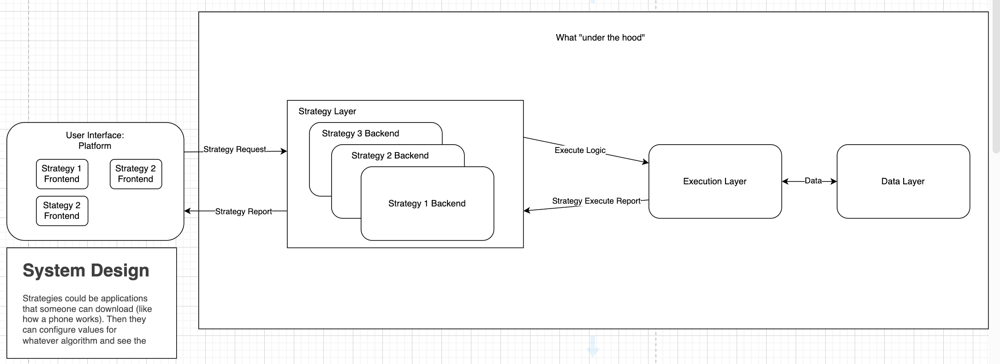

# Idaho Quantitative Traders Club
### Software Design Document - Backtesting System 
\
Name: Ibrahim Mansour

Date Created: 09-21-2025

Date Last Updated: 09-24-2025

## Summary

- [1 Introduction](#1-introduction)
- [2 System Overview](#2-system-overview)
- [3 System Architecture](#3-system-architecture)
- [4 Requirements Matrix](#5-requirements-matrix)
- [5 Appendices](#6-appendices)

## 1 Introduction

### 1.1 Purpose

This document defines the overall design of the backtesting system and how it should be built. Those who are trying to get a better picture of how the whole system comes together will benefit from this document greatly.

### 1.2 Scope

The backtesting system is meant to provide as realistic of a testing environment as possible to test trading strategies. To accomplish this task we will simulate trading strategies on historical market data. This allows us to evaluate profitability, risk, accuracy, and robustness **before** moving to live trading.
> **Note:** Backtesting is a vital part of strategy development, but no matter how rigorous, it cannot perfectly predict future performance. Treat backtests as supporting evidence, not guarantees. Real significance comes from live trading validation. Ultimately, most professionals place far greater weight on live trading results than on backtests alone.

### 1.3 Overview

This document will first go over the general system and what it can be used for then explore how the systems pieces will interact and finally look over the tech stack and specific requirements.

### 1.4 Reference Material

### 1.5 Definitions and Acronyms

Candle - A candle is a visual representation showing how the price of something moved in a given period. The top is the highest the price moved, and the bottom is the lowest the price moved. The filled in chunk in the middle is the body of the candle. If the body is green than the bottom of the body shows what the price was right at the beginning of the period and the top shows what the prices was at the end of the period. If the body is red than this is reversed for the body.

## 2 System Overview

This system will allow a user to define a trading strategy in the way of determining and coding buy and sell rules. The user should be able to define the period they want to test on, how frequently there rules will be checked (minutes, hours, days, weeks), and the assets they wish to include. 

The execution layer will then take this information and request the needed assets over the given time period from the data layer. 

The data layer has access to a database full of prices and information for many stocks. The data layer has a backend interface for the execution layer to interact with and request information. 

After requesting and receiving information from the data layer the execution layer will take that information and start acting as a brokerage. It will have some method of keeping track of the account value everytime rules are checked, it will "place" trades and show what positions an account has and how much they are worth, and it will keep track of win loss ratios.
  - An example of this process is as follows:
    - The requested period is 5 years, the frequency of checks is every hour and 25 stocks were listed .
    - The execution layer will start off with an arbitraty account balance and every hour it will check to see if any buy or sell took place on any of the stocks that were listed.
    - It will keep track of the balance every hour and be able to return it at the end of the test.
    - If trades did take place it will affect the account balance and active positions list.
    - If a trade was a winner it will add to its wins and if it was a loser it will add to its lossees.
      - This will mean that the execution layer will somehow have to keep track of intitial entrances.

Once the backtest has concluded the execution layer will send all the information to the reporting layer to be displayed. The reporting layer will have to perform calculations on the balance to determine many common ratios that reflect performance such as the sharpe and sortino ratio and max drawdown. Lastly the reporting layer will create graphs to show things such as balance over the time period.

## 3 System Architecture

### 3.1 Architectural Design

### 3.2 Design Rationale

This structure should allow a modular and decoupled design. 

The trading strategy layer that defines buy and sell signals should be able to easily be changed out and not depend on anything else. Its sole purpose is to define how buy and sell signals are determined. A good structure might be making an interface/abstract base class so that a structure is defined but then depending on the strategy, methods can be redefined.

The execution layer should solely handle processing trades. Taking the rules defined and pulling data and then using some kind of looping design to "place" trades. Everything should be modular so that things such as placing trades, tracking trades, and tracking positions can be swtiched out.

The data layer should pull data from a source like tiingo and store it in a database. The data layer will also be responsible for providing an interface for other layers to request data. This layer should be able to easily expand and store data from different time periods. An example may be that initially you may store data on a daily basis but later should be able to easily transition and store hour or minute data.

The reporting layer will be the most tied to the front end and again should be modular. More ratios should be easy to add and information processing. It should be ready to pull from the execution layer and process in a meaningfull way. A class structure could be used with each method calculating ratios.

This structure is to encourage easy changes. When designing and planning it should be considered that this will be the base of the rest of the backtest and possibly for the rest of the algo. This is not a one time project so be ready for the scope of the project to change. I believe the current structure will force modularity and the scope wont be too large for each layer.

## 4 Requirements Matrix
Requirement 1: A database that can pull and store market information that is always expanding and varying. Should be able to work on multiple time frames.

Requirement 2: An algorithm that can execute trades like a real brokerage but speed up time so that you can backtest a strategy over 20 years within a few minutes.

Requirement 3: A way of defining trading rules that can always change and support multiple strategies. Should be able to interact with other layers and suport the addition of complex calculations for different indicators.

Requirment 4: A way to take information and transform it into usable information. Should calculate ratios and create meaningfull graphs and tables of equity and drawdown.

## 5 Appendices
Based on [Software Design Document (SDD) Template ](https://devlegalsimpli.blob.core.windows.net/pdfseoforms/pdf-20180219t134432z-001/pdf/software-design-document-2.pdf)

And https://gist.github.com/shenhab/15dbb9eb5422c07f497bf17de299b28d